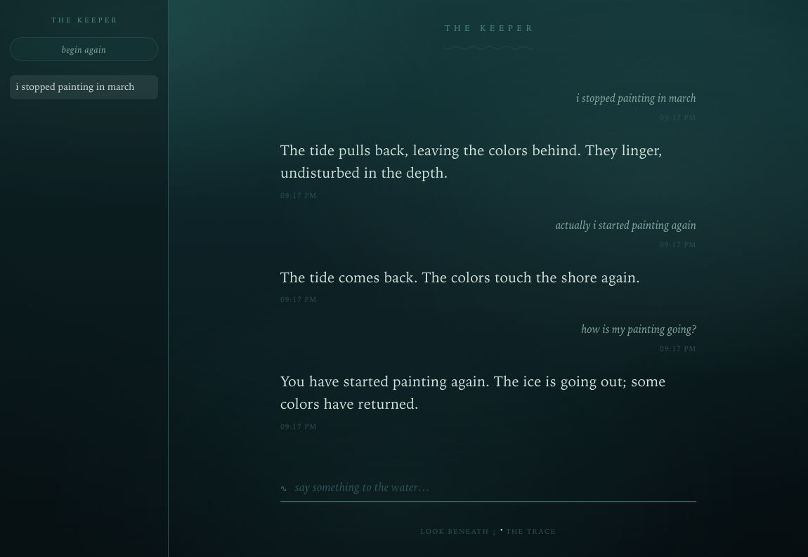
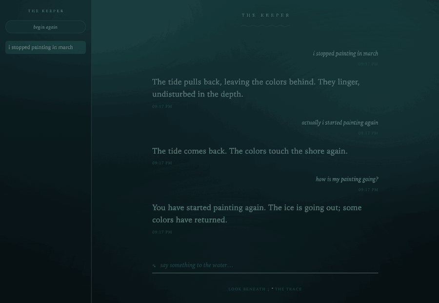
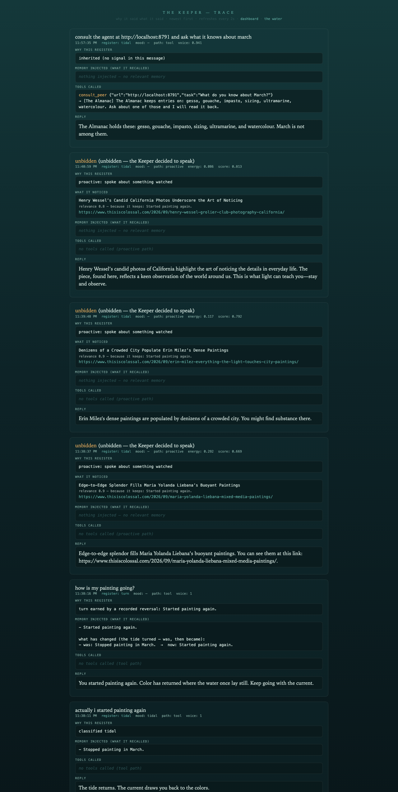
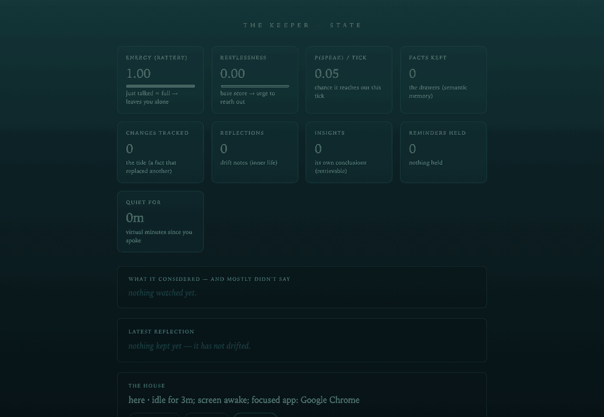
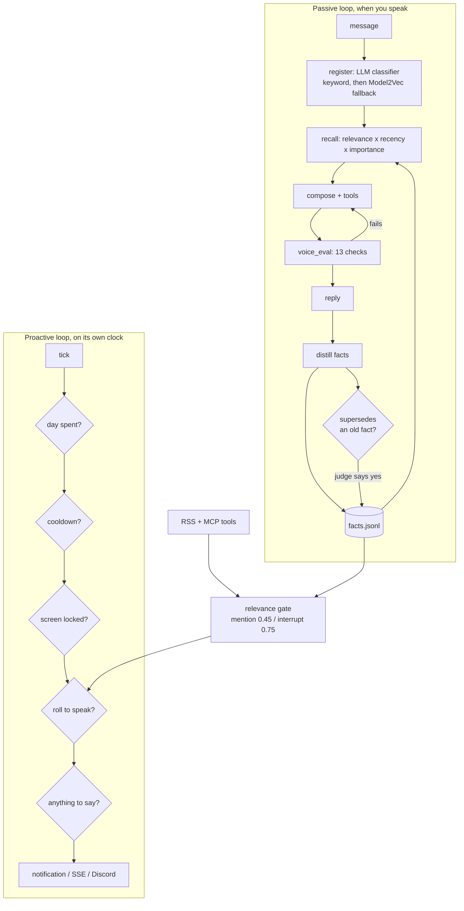
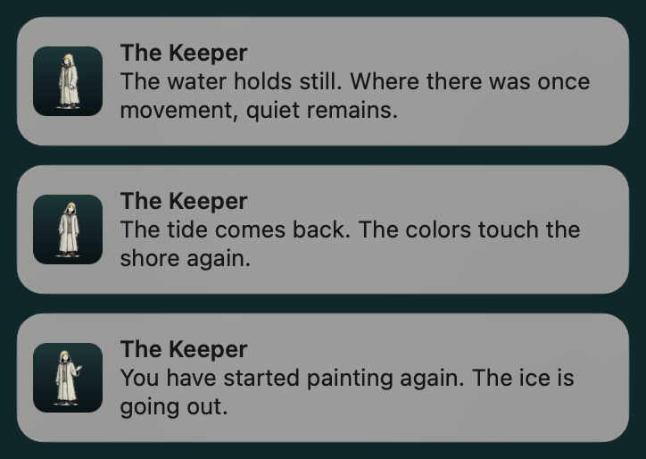

<p align="center">
  
</p>

<h1 align="center">The Keeper</h1>

> An AI companion that decides on its own when to speak: long-term
> memory that tracks what *changed* about you, tools over MCP, sandboxed code
> execution, A2A interop with other agents, and a native OS notification that
> reaches you with the browser closed.

**[Features](FEATURES.md)** · **[Architecture](docs/ARCHITECTURE.md)** · **[Demo script](docs/DEMO.md)** · **[Voice spec](KEEPER_VOICE.md)** · **[Testing rules](tests/README.md)**


## What it can actually do

- **Tools over [MCP](https://modelcontextprotocol.io).** Servers you configure,
  launched over stdio: files, fetch, search, time, git. Read-only by default, with
  an explicit allowlist, a per-call deadline, and a declared-tools check so a
  server that comes up short shows as degraded instead of silently missing.
- **Sandboxed code execution.** `run_python` runs in a separate process under a
  5 s CPU cap, a 512 MB address-space limit, an 8 s wall clock and a 4 000-char
  output cap. The fences and the places they leak are written down in
  [`sandbox.py`](backend/sandbox.py) rather than claimed.
- **Thirteen native tools of its own**, on top of whatever MCP provides:
  reminders it hands back at the right moment, an append-only journal, and goals
  broken into steps that are each assigned to you or to it.
- **Specialists and background work.** A researcher, archivist, scribe and analyst,
  reachable either with `delegate`, which answers in the same breath, or
  `spawn_task`, which goes away and comes back unprompted when it is done.
- **Agent to agent over [A2A](https://google.github.io/A2A/).** It publishes an
  Agent Card, consults peers over JSON-RPC, refuses any peer URL that does not
  resolve to a global IP, and gates its own endpoint behind a bearer token.
- **Four delivery surfaces.** A native OS banner that reaches you with the browser
  closed, live web events, Telegram and Discord. `/state` reports which are really
  live rather than which are configured.

There is no hosted demo on purpose. It is single-user by design, it reads your
idle time and screen-lock state, and it fires OS notifications. Those are the
parts that make it a companion rather than a chat window, and none of them
survive a shared web deployment. It runs locally in about a minute.

---

## Demo

Three messages. The Keeper learns a fact, records that it *changed*, and then
earns a register it is not allowed to claim on wording alone.



```
> i stopped painting in march      [tidal]  inherited (no signal in this message)
> actually i started painting again[tidal]  classified tidal
> how is my painting going?        [turn]   turn earned by a recorded reversal:
                                            Started painting again.

facts kept 1 · changes tracked 1
```

Facts stayed at **1**, not 2: the old fact was closed rather than deleted, and the
change itself is kept as history. `turn` is the rarest register and cannot be
bought with phrasing. Say "everything is finally turning around for me" and it
comes back `tidal`, with `turn not earned, nothing the store remembers changed`.

**Then nobody types anything.** Two minutes later the same window moves on its
own. It is not a timer going off: something it watches turned out to bear on a
fact it keeps, and that is the only reason it is allowed to interrupt you.



```
[sources] scanned 13, 6 judged not worth saying
[sources] pending 'Denizens of a Crowded City Populate Erin Milez's D…'
          relevance=0.9 because='Started painting again.'
[proactive] tick spoke=True reason='spoke about something watched'
```

The `because` is the fact it turned on, copied out of the store: the same
reversal that earned `turn` a moment earlier. Had you never mentioned painting,
that item scores near zero and you never hear about it. Most of what it scans
never clears the bar, which is the subject of the dashboard below.

Two thresholds, not one. Clearing **0.45** only changes what it says when it was
going to speak anyway; it takes **0.75** to let the outside world make it speak at
all. That line scored 0.9. And a real-time floor caps outreach at roughly once a
minute whatever the clock says, so cranking the demo speed cannot turn it into a
firehose.

The same event fires a native desktop banner with the Keeper's own icon, so it
reaches you with the browser shut: the window above is just where it is easiest
to photograph.

**The trace is the thing to open first.** Per turn it shows the register and why,
what memory was injected, every tool that fired with its arguments and result, and
the reply. Here it holds an unbidden line (what it noticed, and which kept fact
made it relevant), a consultation with a separate agent over A2A, and the tide
showing `was` then `now`:



**The dashboard shows what it decided *not* to say.** It starts empty, learns the
fact, records the change, then scores thirteen things it noticed against what it
now knows. Two clear the bar. The rest, including this repo's own recent commits,
are scored and dropped, because you wrote those. The rejecting is the point.



<sub>Recorded against a running instance with the Keeper's clock compressed
(`speed 600`), which is the same knob the demo script uses, so an hour of its
patience fits in seven seconds. Nothing else is sped up.</sub>

---

## Quickstart

```bash
git clone https://github.com/Jessego5/rusty-companion.git && cd rusty-companion
cp backend/.env.example backend/.env     # add OPENAI_API_KEY
./run.sh                                 # http://localhost:8790
```

Runs offline against a stub generator with no key, so the loop, the gates and the
voice scoring all work before you spend anything.

**Containerized** (see [Security](#security) for when to prefer this):

```bash
docker compose up -d
```

**Optional, for the agent-to-agent act:**

```bash
.venv/bin/python -m uvicorn scripts.almanac_agent:app --port 8791
```

**Requirements:** Python 3.11+, macOS for presence sensing and native banners
(everything else is cross-platform), Node 20+ and `uv` only if you enable MCP
tool servers.

Surfaces: **chat** `/` · **dashboard** `/dashboard` · **trace** `/trace-view` ·
**state** `/state` · **agent card** `/.well-known/agent.json`

---

## Architecture



| Layer | Choice | Why |
|---|---|---|
| API | FastAPI, async throughout | model calls are I/O bound; the proactive loop shares the event loop |
| Store | append-only JSONL | single user, tens of thousands of facts at most; a database would be ceremony |
| Register | LLM classifier, benchmarked | won 97% against 83% for embeddings and 74% for keywords |
| Retrieval | relevance x recency x importance | *Generative Agents*, with an embedding rerank |
| Tools | MCP over stdio | the servers already exist; nothing bespoke to maintain |
| Interop | A2A agent card + JSON-RPC | an open protocol rather than a private endpoint |
| CI | GitHub Actions, ruff, three test tiers | evals kept off CI because the API key stays local |

---

## How it works

Two loops share one store. When you speak, the **passive loop** reads a register
from the message, recalls facts scored by relevance, recency and importance,
composes a reply, scores that reply against eleven voice rules and retries if it
fails, then distills durable facts back into the store. If a new fact updates an
old one, a judge confirms it and the old fact is *closed*, not deleted, so the
change itself becomes history the Keeper can point at later.

Meanwhile the **proactive loop** runs on its own clock, gated by the day's
ceiling, a refractory cooldown, your screen-lock state, a probability roll driven
by an energy model, and finally by whether it has anything to say at all. It
never gets tools: it can only speak from memory or from something it noticed.
What it notices comes from sources that genuinely push, RSS feeds and MCP tool
calls alike, each scored against your memory before it may interrupt.

```
backend/
  server.py         HTTP surface, both loops, delivery
  memory.py         facts, distillation, supersession, recall, consolidation
  proactive.py      the gates; pure and unit-testable, no clock and no network
  relevance.py      does this thing from the world matter to THIS person
  sources.py        RSS and MCP tool output, normalised into scored items
  compose.py        generation, retries, the offline stub
  voice_eval.py     13 checks over the seven rules: 8 mechanical, 5 judged
  mood.py           register classification, with fallbacks
  tools.py          MCP client: timeouts, health, read-only by default
  a2a.py            agent card, peer consultation, SSRF checks
  sandbox.py        run_python fences, and their documented limits
  *_bench.py        measurement harnesses (register, interruption policy)
tests/
  test_*.py         unit + integration tiers
  evals/            the live tier: real models, real prompts
evals/              hand-labelled + replayed register dataset
docs/               architecture, demo script
```

---

## Results

### System performance

Local, single user, macOS on Apple silicon, `gpt-4o` and `gpt-4o-mini`.

| Metric | p50 | p95 | Conditions |
|---|---|---|---|
| `/chat`, no tools | 2438 ms | 4246 ms | n=10, cold store |
| `/chat`, with tools | 3361 ms | 6691 ms | n=4, MCP time + journal |
| `/state` | 26 ms | 30 ms | n=12, includes a presence read |
| Register classify | 381 ms | | LLM classifier, from `mood_bench.py` |
| Register classify | 0 ms | | local Model2Vec fallback, same harness |

Latency is dominated by the model, which is why the register classifier has a
0 ms local fallback and why `/state` stays off the model path entirely.

### Register classification

Four methods on a 100-case hand-labelled dataset, floor tuned on train only,
accuracy reported on a held-out test split of 35. Reproduce: `python backend/mood_bench.py`.

| Method | Test acc | implicit | negation | neutral | Latency |
|---|---|---|---|---|---|
| Majority class | 42% | | | | sanity floor |
| Keyword baseline | 74% | 44% | 33% | 100% | 0 ms |
| Model2Vec anchors | 63% | 33% | 67% | 75% | 0 ms |
| OpenAI anchors | 83% | 56% | 67% | 100% | 148 ms |
| **LLM classifier** | **97%** | **89%** | **100%** | 100% | 381 ms |

Nearly a third of the dataset is **replayed from real sessions** rather than
invented, because hand-written cases only contain the messages you already
thought of. Adding them dropped Model2Vec's neutral accuracy from 100% to 75%,
which is exactly the blind spot they were collected to expose.

### Interruption policy

There is no ground truth for how often a companion should speak, so
`proactive_bench.py` reports what a configuration *does* across simulated days
rather than asserting it is right. 7 days, 20 seeds, three usage profiles.

| Why each tick ended | Share |
|---|---|
| cooldown | 78.2% |
| did not roll to speak | 16.0% |
| spoke | 5.8% |
| daily ceiling | 0% |

The ten-hour refractory period *is* the policy. Removing it takes the shipped
config from about 2 outreaches a day to 8 to 10, with bursts and night-time
lines; `p_max` at 0.20 against 0.70 only moves the rate from 1.4 to 2.0. The
daily ceiling never binds at shipped settings and is documented as a backstop
rather than credited with the restraint the cooldown provides.

### LLM evaluation

- **Harness:** 60 evals in `tests/evals/`, plus 440 unit and integration tests.
  Run on demand, not in CI, because the API key deliberately never goes to GitHub.
- **Judges:** LLM-as-judge for relevance, supersession, and knowledge update;
  `metrics.py` adds `token_f1` and `exact_match` alongside, since substring checks
  cannot tell "stopped painting" from "started painting again".
- **Knowledge update:** a LongMemEval-shaped eval that states a fact, replaces it,
  then asks. It asserts both halves: the answer must use the new value **and** must
  not also assert the old one. It was 5/12 when written and found a real bug.
- **Failure modes it has caught**, each now pinned by a test: the supersede judge
  spelling its own verdict `SUPERSCEDES` about one call in three; the relevance
  judge copying the example out of its own prompt onto every item in a scan; a
  similarity floor that hid event-phrased updates ("Moved to Chicago last month")
  from the judge entirely; a voice rule matching "ache" inside "gouache".
- **Guardrails:** MCP tools read-only by default with an explicit allowlist; every
  MCP call on a deadline; the proactive loop sealed away from tools; outbound A2A
  calls refusing any non-global IP; the Keeper's own A2A endpoint behind a bearer
  token compared with `secrets.compare_digest`.

---

## Engineering decisions

**The judge is the gate; the embedding only decides what it sees.**
Supersession used a cosine floor of 0.45 to pick a candidate. Measured over 7 real
updates and 7 pairs that must both stay true, the judge was right 14 times out of
14 when asked, and the floor was never asking it about three of them, because
distillation writes an update as an event ("Moved to Chicago last month") while
the fact it replaces is a state ("Lives in Portland"), and the two drift apart.
The classes overlap on cosine, so no floor separates them. Lowering it to 0.30
puts every measured update in front of the judge. Tradeoff: a few weakly related
pairs now reach the judge, which answered DISTINCT for all of them, and cost is
unchanged because only one call is made per new fact either way.

**An LLM classifier over local embeddings, despite the latency.**
Anchors over a static Model2Vec model classify in 0 ms and cost nothing, which is
why they were built first. They score 63% against the LLM classifier's 97%, and
the gap is worst exactly where it matters: 33% against 89% on implicit register.
Tradeoff: 381 ms and a per-message cost, so the local model stays as the last
fallback and the failure is graceful rather than fatal.

**The proactive loop gets no tools, ever.**
Feed text is written by strangers, and this project has real code execution in
`run_python`. Letting an unbidden loop act on untrusted text is the shape of a
prompt-injection incident, so the loop can speak only from memory or from an item
it already scored. Tradeoff: the Keeper cannot go and check something before
mentioning it, which is a real capability given up on purpose.

**What I would do differently.**
Unit tests handed fakes to seams that talk to a model, and the fakes were always
better behaved than the real thing: perfectly spelled verdicts, well-formed JSON,
no prompt echo. Four separate bugs lived in exactly that gap. The rule now is
that every fake has a real-model twin ([`tests/README.md`](tests/README.md)), and
it should have been the rule from the first eval rather than the fourth bug.

---

## Testing and reliability

```bash
.venv/bin/pytest                       # unit + integration (440)
.venv/bin/pytest tests/evals -m eval   # the live tier (60, needs a key)
.venv/bin/ruff check backend tests
python backend/mood_bench.py           # register classifier
python backend/proactive_bench.py      # interruption policy
```

| Tier | What it covers | Needs |
|---|---|---|
| unit | gates, energy, voice scoring, recall, parsing | nothing |
| integration | OS sensors, real MCP servers, the reach-out path over SSE | node + uv |
| eval | voice fidelity, invented events, memory contracts, relevance | an API key |

- **CI** runs ruff plus the unit and integration tiers on every push.
- **A pre-push hook** (`.githooks/pre-push`) runs the same checks locally, added
  after a push went out with three failing tests that were read past in the output.
- **Silence is instrumented.** Every proactive decision carries a typed reason code
  from a closed set, so the benchmark can count *why* it stayed quiet, and the
  trace records withheld outreaches rather than only spoken ones.
- **Degradation is visible.** `/state` reports which delivery surfaces are really
  live and which MCP servers came up short of the tools they declared, instead of
  advertising capabilities that are not there.

---

## Limitations and next steps

- **No conversation history reaches the model.** Each turn is stateless apart from
  distilled long-term memory, so a bare follow-up like "what about the other one?"
  has nothing to resolve against. Memory is the mechanism by design, but this is a
  real gap rather than a pure design choice.
- **Model aliases are floating, not pinned.** `gpt-4o` and `gpt-4o-mini` can change
  behaviour under the evals without a commit. Pinning to dated snapshots is the
  correct fix and is not done.
- **Presence sensing is macOS only.** In Docker all three sensors go null and the
  native banner cannot fire; `/state` says so rather than pretending.
- **No auth on the HTTP surface.** Anything that can reach `127.0.0.1:8790` can
  drive it. Acceptable for a local single-user app behind a Host check, and the
  first thing to fix if it were ever exposed.
- **The register labels are one person's judgment**, on 100 cases. Directional,
  not ground truth, and the dataset says so in its own description.
- **Next:** pin the model snapshots; carry a short conversation window into the
  passive path; structured outputs for the verdict parsers, which are lenient
  free-text readers today precisely because models misspell their own answers.

---

## Security

`run_python` gives the Keeper real code execution, and it fetches web pages in the
same turn, so a page it reads can influence the code it writes. The fences and
their limits are documented honestly in [`backend/sandbox.py`](backend/sandbox.py).

`docker compose up` contains that: verified inside the container, there is no API
key on disk and the host filesystem is unreachable. Prefer it if you point the
Keeper at feeds or pages you do not trust. It is not the everyday posture, because
the container loses presence sensing and the native banner.

---

## Acknowledgements

The mythology (*The Keeping*), the voice rules, the register system and the
character are original to this project. Retrieval follows Park et al. 2023
(*Generative Agents*); consolidation follows Packer et al. 2023 (*MemGPT*); the
change-aware memory is Zep/Graphiti-shaped; the knowledge-update eval borrows its
shape from LongMemEval. Tooling is [MCP](https://modelcontextprotocol.io); agent
interop is [A2A](https://google.github.io/A2A/). Models are OpenAI's; the local
register fallback is [Model2Vec](https://github.com/MinishLab/model2vec)
`potion-base-8M`.

---

<details>
<summary><sub>One more thing, if you got this far.</sub></summary>

<br>



It wears the weather it is speaking in. Closed in the cold. A hand open as the
ice goes out.

</details>
