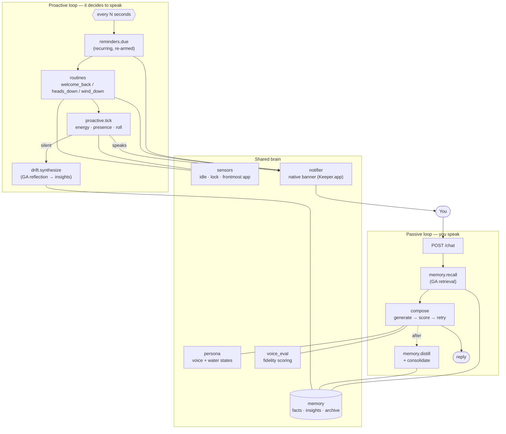

# The Keeper — Architecture

A draft you can lift into the README. Diagram + module map + the research the memory
system is built on. Edit freely.

## What it is

The Keeper is a proactive, memory-driven AI companion. Two things make it an *agent*
rather than a chatbot:

1. **It acts unbidden.** A background loop decides on its own when to reach out —
   gated by an energy model, the person's presence, and whether it actually has
   something to say — and delivers via a native OS notification that works with the
   browser closed.
2. **It remembers and reflects.** Durable facts are extracted from conversation,
   retrieved by a research-grade relevance function, periodically synthesized into
   higher-level insights, and compressed under memory pressure.

## The two loops

## Memory: the research-grade core

Two papers, mapped to code:

| Paper | Idea | Where it lives |
|---|---|---|
| **Generative Agents** (Park et al., 2023) | Retrieval = **recency · decay + importance + relevance**, each min-max normalized then summed | `memory.rank_facts` |
| | **Importance / poignancy** (1–10) assigned when a memory forms | `memory.distill` (inline `[kind\|N]`) |
| | **Reflection**: salient questions → retrieve → synthesize higher-level insights, stored back as retrievable memories | `drift.synthesize` |
| **MemGPT** (Packer et al., 2023) | **Memory pressure**: evict old, low-value content to external storage under recursive summarization | `memory.consolidate` → `*_archive.jsonl` |

Persona guardrail: synthesized insights are stored as `kind="insight"` and rendered
under *"what you've come to understand"* — retrievable like any memory (faithful to
the paper) but never recited back as the person's own words.

## Planning: autonomous goal pursuit

The pattern that makes the Keeper an *agent* rather than a reactive companion. When
the person expresses something they want to move toward, the Keeper takes it on as a
**Goal**, an LLM **planner** decomposes it into 2–5 concrete steps, and the proactive
loop **works the plan over time** — advancing one step per due cycle, reaching out in
voice to help with or invite it, then scheduling the next check. This maps to the
canonical *Planning* agentic pattern (decompose → act → observe → repeat), on top of
the *Tool Use* and *Memory* patterns already present.

| Piece | Role | Where |
|---|---|---|
| Goal / Step store | persistent plan state; each step is `[keeper]` or `[person]` | `tasks.GoalStore` |
| Planner | decomposes a goal into steps AND labels who does each | `planner.plan` |
| **Reflection** | evaluator-optimizer: critique the plan, re-plan if weak | `planner.critique_plan` |
| Goal tools | `set_goal` / `advance_goal` / `list_goals` / `complete_goal` | `native_tools` |
| Autonomous advance | dispatches a due goal's next step, under the circuit breaker | `server._maybe_advance_goal` |
| **Execute (ReAct)** | a `[keeper]` step: DO it with tools, observe, advance the goal itself | `server._execute_goal_step` |
| Nudge | a `[person]` step: help/invite it; done only when they report it | `server._nudge_goal_step` |

The agent-vs-human split is the core: a `[keeper]` step (look something up, read a file,
draft, keep a note) the Keeper **executes itself** via `tool_reply` — real ReAct: call a
tool, observe, advance — and delivers the result re-voiced. A `[person]` step it nudges
and waits for `advance_goal`. On honest failure a keeper step is handed back to the person.

Outreach priority each tick (when the real-time breaker allows): **due goal → house
routine → restless energy**. Purposeful work comes before mood.

## Multi-agent: sub-agents + supervisor

For a task too involved for one tool call, the Keeper delegates to a **sub-agent** — a
focused specialist that runs its *own* tool loop with only the tools it needs, then
returns a result the Keeper speaks from. This is the reference agent's supervisor + sub-agent
pattern kept legible: three roles, not a fleet framework.

| Specialist | Does | Tools it gets |
|---|---|---|
| researcher | looks things up on the web, synthesizes | search, fetch |
| archivist | digs through the person's files/notes/history | files, git, time, journal |
| scribe | drafts a message, note, or short plan | journal |
| analyst | works answers out by writing + running code | run_python (sandbox) |

**Code-as-action** (`sandbox.py`): the Keeper — and the analyst — can `run_python`, a
snippet executed in a fenced subprocess (isolated mode, wall-clock timeout, CPU+memory
rlimits, throwaway cwd, capped output). It stops runaways and accidents, not malicious
code — stated plainly in the module. The reference agent's `shell.py`, scoped to Python.

`subagents.route` (a tiny LLM router) picks the specialist; `subagents.run` gives it a
scoped tool view (`_FilteredMCP`) and runs its loop; `delegate` is the supervisor entry
point. Exposed two ways: a **`delegate` tool** the main Keeper calls in chat, and the
**goal executor**, which routes every `[keeper]` step through a specialist. Recursion is
blocked — a sub-agent can't spawn sub-agents.

## The house: agentic OS integration

- **Recurring reminders** — `daily` / `weekly` / `weekdays` / `every N …`, re-armed to
  the next future occurrence on delivery (`reminders.next_occurrence`), catch-up-storm
  safe.
- **Presence-driven routines** — a stateful engine watches the idle signal across
  ticks to catch *transitions* a single read can't: `welcome_back` (returned from
  away), `heads_down` (long unbroken focus), `wind_down` (late evening). Fires in the
  Keeper's voice ahead of the random restlessness roll (`routines.RoutineEngine`).
- **Native notifications** — backend-fired macOS banners via a rebranded `Keeper.app`
  (built by `scripts/build_keeper_notifier.sh`) so the Keeper's own icon and name are
  the primary badge; reaches you with the browser closed (`notifier`).
- **Delivery channels** — a proactive line fans out to every enabled surface at once
  behind one `Channel` contract (the reference agent's `infra/channels` pattern): the web page
  (SSE), the native banner, and — opt-in with a bot token — a Telegram message on your
  phone. Adding a surface is adding a `Channel`; the loop that decides *when* to speak
  never changes (`channels`).

## Module map

| Module | Responsibility |
|---|---|
| `server.py` | FastAPI app, `AppState`, the proactive loop, all endpoints (`/chat`, `/state`, `/events` SSE, `/config`, sessions) |
| `persona.py` | The Keeper's identity, personality rules, water states, system-prompt assembly |
| `compose.py` | One on-voice line: generate → score → retry → fall back or fall silent; `tool_reply` routes tool calls |
| `voice_eval.py` | Fidelity scoring of a line; emotional-register detection |
| `memory.py` | Fact store, GA retrieval, distillation, MemGPT consolidation, archive tier |
| `embedder.py` | OpenAI embeddings for semantic recall/dedup (injectable) |
| `drift.py` | Idle reflection: a private note, or GA insight synthesis |
| `energy.py` | Multi-timescale "battery" — how restless it is |
| `proactive.py` | One proactive decision: presence + energy + roll gates |
| `routines.py` | Presence-driven house routines |
| `tasks.py` | Goal/Step store — persistent plan state; steps labelled keeper/person |
| `planner.py` | Decomposes + labels a goal's steps; reflection (evaluator-optimizer) |
| `journal.py` | The Keeper's one WRITE capability — append-only kept notes |
| `subagents.py` | Specialists (researcher/archivist/scribe/analyst) + router + supervisor |
| `sandbox.py` | Fenced Python execution (code-as-action) — timeout, rlimits, isolation |
| `reminders.py` | Reminder store + recurrence |
| `native_tools.py` | The Keeper's own action tools (remind / list / complete) |
| `tools.py` | MCP manager — connects configured servers (files, fetch, search, time, git), applies a read-only filter + per-server allowlist |
| `sensors.py` | Read-only macOS presence (idle, lock, frontmost app) |
| `sessions.py` | Persistent per-conversation history (the sidebar) |
| `channels.py` | Delivery-surface abstraction: web (SSE) + native banner + opt-in Telegram, fanned out best-effort |
| `notifier.py` | Native macOS notifications, backend-fired |
| `mood.py` / `mood_bench.py` | Local mood classifier (Model2Vec) + its benchmark |
| `eval_harness.py` | Eval metrics + JSON snapshots |

## Testing

Tiered `pytest` suite (`unit` / `integration` / `eval` markers): pure logic always
runs; OS/MCP tests self-skip without their deps; LLM-behavior evals run explicitly
with a key. All model calls are injected, so the whole brain is testable offline.

## References

- J. S. Park et al., *Generative Agents: Interactive Simulacra of Human Behavior*, 2023.
- C. Packer et al., *MemGPT: Towards LLMs as Operating Systems*, 2023.
